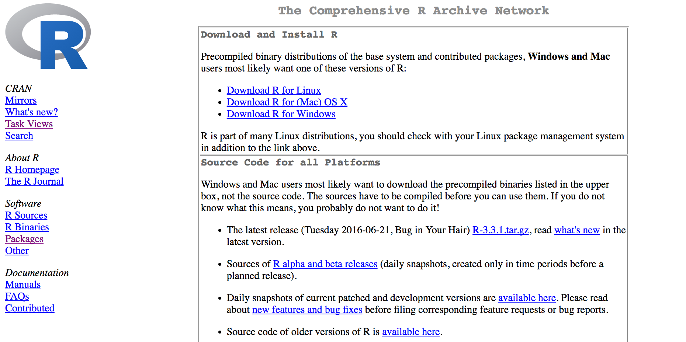
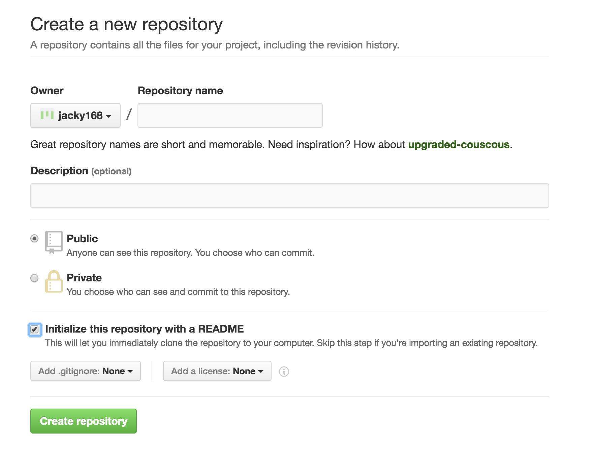

## Data Scientist: The Sexiest Job of the 21st Century


Source: https://hbr.org/2012/10/data-scientist-the-sexiest-job-of-the-21st-century/

```{r global_options, include=FALSE}
knitr::opts_chunk$set(fig.width=12, fig.height=8, fig.path='images/',
                      echo=FALSE, warning=FALSE, message=FALSE)
```

## Data Science Venn Diagram


Source: http://drewconway.com/zia/2013/3/26/the-data-science-venn-diagram

## Objective of this course 

- This course focuses on hacking skill
- We use R as the programming language
- Learning by doing is the best approach 
- R is simpler than C/C++, Java, and Python
- Besides R, we will also cover basic data analysis


## R vs. Python


Source: http://www.kdnuggets.com/2015/05/r-vs-python-data-science.html

## When and how to use R?
- R is mainly used when the data analysis task requires standalone computing or analysis on individual servers
- It’s great for exploratory work, and it's handy for almost any type of data analysis because of the huge number of packages and readily usable tests that often provide you with the necessary tools to get up and running quickly
- R can even be part of a big data solution.

## IDE and packages for R
- When getting started with R, a good first step is to install the amazing RStudio IDE
- dplyr, plyr and data.table to easily manipulate packages
- stringr to manipulate strings
- zoo to work with regular and irregular time series,
- ggvis, lattice, and ggplot2 to visualize data, and
- caret for machine learning

## When and how to use Python?
- You can use Python when your data analysis tasks need to be integrated with web apps or if statistics code needs to be incorporated into a production database

- Being a fully fledged programming language, it’s a great tool to implement algorithms for production use

## IDE and Packages for Python
- Python has no clear “winning” IDE. We recommend you to have a look at Spyder, IPython Notebook and Rodeo to see which one best fits your needs
- NumPy /SciPy (scientific computing) 
- pandas (data manipulation) to make Python usable for data analysis
- matplotlib to make graphics
- scikit-learn for machine learning

## Machine Learning
- Machine learning is a subfield of computer science that evolved from the study of pattern recognition and computational learning theory in artificial intelligence
- Machine learning explores the study and construction of algorithms that can learn from and make predictions on data
- Machine learning is closely related to and often overlaps with computational statistics; a discipline that also specializes in prediction-making. It has strong ties to mathematical optimization, which delivers methods, theory and application domains to the field

Source: https://en.wikipedia.org/wiki/Machine_learning

## Where is Data From?


## Data is growing exponentially


## What's Big Data
“Big Data” refers to data that grows so large that it is difficult to
 capture, store, manage, share, analyze and visualize with the 
typical hardware environments and database software tools


Source : Solutions Big Data IBM, 2012

## Data-Driven Decision Making
Decisions that previously were based on guesswork, or on painstakingly constructed models of reality, can now be made based on the data itself
http://www.cra.org/ccc/docs/init/bigdatawhitepaper.pdf


Source : New York Times

## Data Processing Flow


## 

R & RStudio

## What's R
- R is a scripting language for statistical data manipulation and analysis
- It was inspired by, and is mostly compatible with, the statistical language S developed by AT&T
- R has become more popular than S/S-Plus, both because it’s free and because more people are contributing to it


## Why R?
- a public-domain implementation of the widely-regarded S statistical language; R/S is the de facto standard among professional statisticians
- comparable, and often superior, in power to commercial products in most senses
- available for Windows, Macs, Linux
- in addition to enabling statistical operations, it’s a general programming language, so that you can automate your analyses and create new functions
- object-oriented and functional programming structure
- open-software nature means it’s easy to get help from the user community, and lots of new functions get contributed by users, many of which are prominent statisticians

## R and functional programming
R has many functional programming features. Roughly speaking, these allow one to apply the same function to all elements of a vector, or all rows or columns of a matrix or data frame, in a single operation. The advantages are important:

- Clearer, more compact code
- Potentially much faster execution speed
- Less debugging (since you write less code)
- Easier transition to parallel programming

## Visualization
R has provided a basic plotting envirorment for you.

```{r, echo=FALSE}
plot(cars)
```

## ggplot2
But, ggplot2 is a more powerful visualization package in R.

```{r}
library(ggplot2)
ggplot(data=cars, aes(x=speed, y=dist)) + geom_point()
```


## R Installation
You can download R from https://cran.r-project.org/ according to your OS.




## RStudio
You can download RStudio from https://www.rstudio.com/products/rstudio/download2/.


## Customize your RStudio
You can customize RStudio according to your own requirements. For example, you can change the code appearance, panel layout, and background color.

##R Markdown
R Markdown provides an authoring framework for data science. You can use a single R Markdown file to both

- save and execute code
- generate high quality reports that can be shared with an audience

R Markdown documents are fully reproducible and support dozens of static and dynamic output formats.

## 1-minute Introduction Video

1-minute video: https://vimeo.com/178485416

## Simple Demo from RStudio

1-example.Rmd


## git and github
- git is a source code version control system, which a series of "commits" or snapshots of your code. You make the commits manually
- gitHub is a code hosting platform for version control and collaboration. It lets you and others work together on projects from anywhere


## Create a Repository on the github site
- The first step is to create a github account
- Then, you can create a new repository




## How to get help in R?
- use ? or help to find the document for a function 
- Search stackoverflow.com
- Google it
- Ask your colleagues

## Example
The following stackoverflow page provides detailed information about getting help in R.

[stackoverflow page](http://stackoverflow.com/questions/15289995/how-to-get-help-in-r)


## R Markdown/git/github

- Detailed introduction to R Markdown/git/github will be presented in the future
- But you still can start to use these tools by yourselves
- rmarkdown-cheatsheet-2.0.pdf and rmarkdown-reference.pdf are availaboe for your reference

## Howework 0
- Install R & RStudio
- Customize your own RStudio environment and try to be familiar with it
- Create a github account, and create a new repository ``hello-world''. Send your repository URL to TAs
- Start coding


