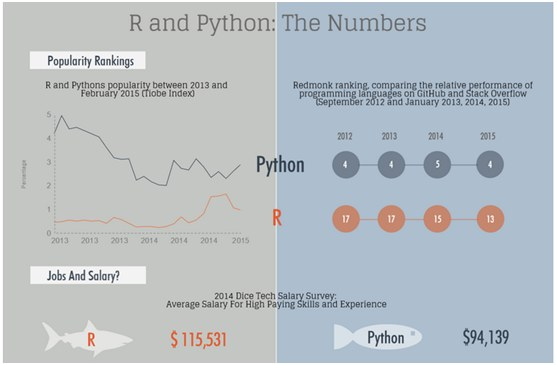

## Data Scientist: The Sexiest Job of the 21st Century


Source: https://hbr.org/2012/10/data-scientist-the-sexiest-job-of-the-21st-century/


## Data Science Venn Diagram


Source: http://drewconway.com/zia/2013/3/26/the-data-science-venn-diagram

## Objective of this course 

- This course focuses on hacking skill
- We use R as the programming language
- Learning by doing is the best approach 
- R is simpler than C/C++, Java, and Python
- Besides R, we will also cover basic data analysis


## R vs. Python



Source: http://www.kdnuggets.com/2015/05/r-vs-python-data-science.html

## When and how to use R?
- R is mainly used when the data analysis task requires standalone computing or analysis on individual servers
- It’s great for exploratory work, and it's handy for almost any type of data analysis because of the huge number of packages and readily usable tests that often provide you with the necessary tools to get up and running quickly
- R can even be part of a big data solution.

## IDE and packages for R
- When getting started with R, a good first step is to install the amazing RStudio IDE
- dplyr, plyr and data.table to easily manipulate packages
- stringr to manipulate strings
- zoo to work with regular and irregular time series,
- ggvis, lattice, and ggplot2 to visualize data, and
- caret for machine learning

## When and how to use Python?
- You can use Python when your data analysis tasks need to be integrated with web apps or if statistics code needs to be incorporated into a production database

- Being a fully fledged programming language, it’s a great tool to implement algorithms for production use

## IDE and Packages for Python
- Python has no clear “winning” IDE. We recommend you to have a look at Spyder, IPython Notebook and Rodeo to see which one best fits your needs
- NumPy /SciPy (scientific computing) 
- pandas (data manipulation) to make Python usable for data analysis
- matplotlib to make graphics
- scikit-learn for machine learning

## Machine Learning
- Machine learning is a subfield of computer science that evolved from the study of pattern recognition and computational learning theory in artificial intelligence
- Machine learning explores the study and construction of algorithms that can learn from and make predictions on data
- Machine learning is closely related to and often overlaps with computational statistics; a discipline that also specializes in prediction-making. It has strong ties to mathematical optimization, which delivers methods, theory and application domains to the field

Source: https://en.wikipedia.org/wiki/Machine_learning

## Where is Data From?


## Data is growing exponentially


## What's Big Data
“Big Data” refers to data that grows so large that it is difficult to
 capture, store, manage, share, analyze and visualize with the 
typical hardware environments and database software tools


Source : Solutions Big Data IBM, 2012

## Data-Driven Decision Making
Decisions that previously were based on guesswork, or on painstakingly constructed models of reality, can now be made based on the data itself
http://www.cra.org/ccc/docs/init/bigdatawhitepaper.pdf


Source : New York Times

## Data Processing Flow


## 

R & RStudio

## What's R


## Why R?

## Visualization

```{r, echo=FALSE}
plot(cars)
```


## R Installation

## RStudio

## Howework 0
- Install R & RStudio
- Customize your own RStudio environment and try to be familiar with it
- Start coding


